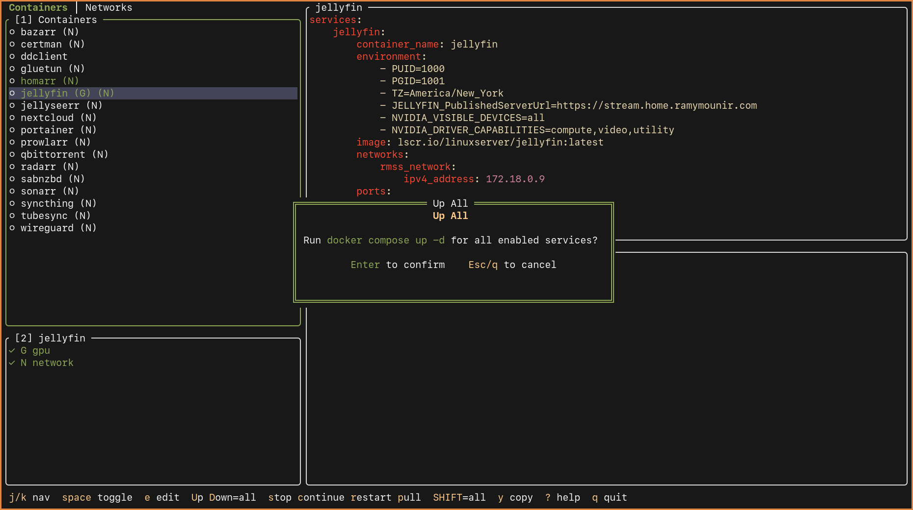

# lazyrmss

A terminal UI for managing Docker Compose services through modular YAML configurations. Navigate categories of services, toggle addons, preview resolved YAML, and execute Docker commands — all from a single keyboard-driven interface.




## Features

- **Categorized service management** — Organize Docker services into categories (tabs) and navigate between them
- **Modular addon system** — Layer optional YAML overrides (GPU, networking, etc.) on top of base service configs with deep merging
- **Live YAML preview** — See the resolved Docker Compose YAML with syntax highlighting (Gruvbox theme) as you toggle services and addons
- **Docker commands** — Run `up`, `down`, `stop`, `start`, `restart`, and `pull` on individual services or all enabled services at once
- **Real-time status** — Polls the Docker daemon to show running/stopped state for containers, networks, and volumes
- **Persistent state** — Remembers which services and addons are enabled across sessions
- **Clipboard support** — Copy resolved YAML for a single service or the entire composition (supports wl-copy, xclip, xsel)
- **In-place editing** — Open base or addon YAML files in your `$EDITOR` without leaving the TUI
- **Vim-style navigation** — `h/j/k/l`, tabs, panels, and modal confirmations

## Installation

### Prerequisites

- Go 1.22+
- Docker
- A clipboard tool (optional): `wl-copy`, `xclip`, or `xsel`

### Build from source

```sh
git clone https://github.com/ramy/lazyrmss.git
cd lazyrmss
make install
```

This compiles the binary and copies it to `~/.local/bin/lazyrmss`. Make sure `~/.local/bin` is in your `$PATH`.

To build without installing:

```sh
make build    # produces ./lazyrmss
make run      # builds and runs immediately
```

## Setup

lazyrmss reads service definitions from a resources directory (default `$XDG_CONFIG_HOME/rmss`). Create your service structure like this:

```
~/.config/rmss/
├── services/                   # category (becomes a tab)
│   ├── nginx/                  # service
│   │   ├── base.yaml           # required — base Docker Compose config
│   │   ├── gpu.yaml            # optional addon
│   │   └── network.yaml        # optional addon
│   └── redis/
│       └── base.yaml
├── databases/                  # another category/tab
│   ├── postgres/
│   │   ├── base.yaml
│   │   └── replication.yaml
│   └── mysql/
│       └── base.yaml
```

Each subdirectory of `resources_dir` is a **category** (shown as a tab). Each subdirectory within a category is a **service**. Inside each service folder:

- `base.yaml` — the base Docker Compose definition (required)
- Any other `*.yaml` file — an addon that can be toggled on/off and deep-merged with the base

### Example base.yaml

```yaml
services:
  nginx:
    image: nginx:latest
    ports:
      - "80:80"
    volumes:
      - ./html:/usr/share/nginx/html
```

### Example addon (network.yaml)

```yaml
services:
  nginx:
    networks:
      - proxy

networks:
  proxy:
    external: true
```

When the addon is enabled, it is deep-merged with `base.yaml` — maps merge recursively and lists are concatenated.

## Configuration

Create `~/.config/lazyrmss/config.yaml` to override defaults:

```yaml
resources_dir: "$XDG_CONFIG_HOME/rmss"  # root directory for service categories
poll_interval: 3                         # Docker polling interval in seconds
```

All paths support `~` expansion and environment variables (`$XDG_CONFIG_HOME` and `$XDG_DATA_HOME` fall back to `~/.config` and `~/.local/share` respectively if unset). If no config file exists, defaults are used.

### Directories

lazyrmss follows the [XDG Base Directory Specification](https://specifications.freedesktop.org/basedir-spec/latest/).

| Purpose | Resolution order |
|---|---|
| Config (`config.yaml`) | `$LAZYRMSS_CONFIG_DIR` > `$XDG_CONFIG_HOME/lazyrmss` > `~/.config/lazyrmss` |
| Data (`state.yaml`) | `$LAZYRMSS_DATA_DIR` > `$XDG_DATA_HOME/lazyrmss` > `~/.local/share/lazyrmss` |

The `resources_dir` is defined in `config.yaml` and is independent of these directories.

## Usage

```sh
lazyrmss
```

### UI Layout

```
╭──────────────────────────────────────────────────────────────────╮
│  Services │ Databases │ Cache                          (Tab Bar) │
├────────────────────────┬─────────────────────────────────────────┤
│ [1] Services           │ Preview                                 │
│  ● nginx         [N]  │  services:                               │
│  ○ redis               │    nginx:                               │
│  ● postgres            │      image: nginx:latest                │
│                        │      ports:                              │
├────────────────────────│        - "80:80"                         │
│ [2] nginx              ├─────────────────────────────────────────┤
│  ✓ network             │ Log                                     │
│  ✗ gpu                 │  $ docker compose up -d                 │
│                        │  ✓ Done                                 │
├────────────────────────┴─────────────────────────────────────────┤
│  j/k nav  space toggle  e edit  U up  D down  ? help             │
╰──────────────────────────────────────────────────────────────────╯
```

**Panels:**
- **Options** (left top) — list of services in the current category
- **Addons** (left bottom) — addons for the selected service
- **Preview** (right top) — syntax-highlighted resolved YAML
- **Log** (right bottom) — output from Docker commands

**Status indicators:**
- `●` running container / `○` stopped
- Green text = enabled / white text = disabled
- `✓` addon active / `✗` addon inactive

### Keybindings

#### Navigation

| Key | Action |
|---|---|
| `j` / `k` | Move cursor down / up |
| `h` / `l` | Previous / next panel |
| `Tab` / `Shift+Tab` | Cycle panels |
| `[` / `]` | Previous / next tab |
| `1` / `2` | Jump to Options / Addons panel |
| `J` / `K` | Scroll preview down / up |
| `Esc` | Back to Options panel or quit |

#### Actions

| Key | Action |
|---|---|
| `Space` / `Enter` | Toggle selected service or addon |
| `e` | Edit selected file in `$EDITOR` |
| `y` | Copy selected service YAML to clipboard |
| `Y` | Copy full compose YAML to clipboard |
| `?` | Show help |
| `q` | Quit |

#### Docker commands (Options panel only)

| Key | Scope | Action |
|---|---|---|
| `u` | Single | Compose up (start service) |
| `U` | All | Compose up all enabled services |
| `d` | — | Compose down (stop and remove) |
| `s` / `S` | Single / All | Stop |
| `c` / `C` | Single / All | Start (continue) |
| `r` / `R` | Single / All | Restart |
| `p` / `P` | Single / All | Pull images |

All Docker commands prompt for confirmation before executing.

## How it works

1. **Discovery** — On startup, lazyrmss scans `resources_dir` for category directories, each containing service directories with `base.yaml` and optional addon files.

2. **Composition** — When you toggle services and addons, lazyrmss deep-merges the active addon YAMLs into the base config and shows the result in the preview pane.

3. **Execution** — Docker commands compose a temporary YAML from all enabled services (with their active addons merged in) and run `docker compose` against it. Single-service commands target the specific container directly.

4. **Polling** — A background goroutine queries Docker every few seconds for running containers, networks, and volumes, updating the UI status indicators in real time.

5. **State** — Enabled services and active addons are saved to `state.yaml` in the data directory on every toggle, so your selections persist across sessions.

## License

See [LICENSE](LICENSE) for details.
